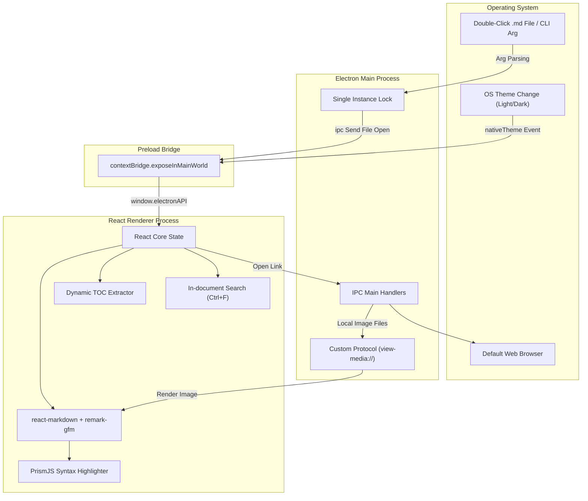

# Implementation Plan - view.md Desktop Reader

`view.md` is a lightweight, premium desktop Markdown reader built with **Electron**, **React**, **TypeScript**, and **Tailwind CSS**. It is designed to be the default `.md` reader on Windows, offering a distraction-free, high-performance, and visually gorgeous alternative to opening full-featured code editors for simple documentation reading.

---

## 1. System Architecture & Component Design

The application will be structured into three main logical parts:

1. **Main Process (`src/main/main.ts`)**: Manages the desktop lifecycle, OS-native window creation, system theme detection (light/dark/system), IPC event routing, single-instance locking (to open new files in the existing window), and custom protocol handling for secure local asset loading.
2. **Preload Script (`src/main/preload.ts`)**: Exposes a secure, context-isolated bridge (`window.electronAPI`) containing only required methods for file reading, dialogue prompting, opening external links, and listening to incoming file-open events.
3. **Renderer Process (`src/renderer/...`)**: A modern React + Vite + TypeScript application styled with Tailwind CSS, utilizing `react-markdown` and `remark-gfm` for highly accurate GitHub-flavored rendering.



---

## 2. Key Technical Features & Implementations

### A. Custom Protocol for Secure Local Images (`view-media://`)

- **Problem**: Electron blocks loading of absolute local files (`file://` URLs) in the renderer if `webSecurity` is enabled (which is critical for security). Relative image references (e.g., ``) will fail.
- **Solution**: We will register a custom protocol `view-media://` in the Main process.
- In the renderer, when parsing markdown, we will rewrite image URLs:
  - Absolute local path `C:\path\to\image.png` -> `view-media://C:\path\to\image.png`
  - Relative path `./img/logo.png` (relative to current file `C:\docs\readme.md`) -> `view-media://C:\docs\img\logo.png`
- The Main process decodes the path and returns the file securely.

### B. Single Instance Lock & File Association

- To enable double-clicking files on Windows:
  - When a `.md` file is double-clicked, Windows launches `view.md.exe` with the file path as the first argument (`process.argv[1]`).
  - If the app is **already open**, we should NOT open a new window. We intercept it in the Main process using `app.requestSingleInstanceLock()`.
  - The second instance passes its command-line arguments to the first instance, which opens the new file in the existing window and brings it to the front.

### C. Syntax Highlighting: Shiki vs. PrismJS

- **NFR Startup Performance Requirement**: Target `< 1s`, Ideal `< 500ms`.
- **Comparison**:
  - **Shiki**: Beautiful VS Code-equivalent highlighting using TextMate grammars. However, Shiki relies on downloading and parsing large WASM assets and themes, which typically adds **150ms - 300ms** to initial rendering and increases memory footprint.
  - **PrismJS**: Lightweight, regex-based, incredibly fast initialization (< 10ms), standard styling using CSS.
- **Proposal**: We will use a pre-styled **PrismJS** highlighter. This keeps the initial bundle size minimal, avoids slow WASM loads, and ensures the **< 500ms** startup performance is easily met.

### D. Keyboard-friendly Search (Ctrl+F)

- We will build a customized, sleek overlay search bar that activates on `Ctrl+F` (or `Cmd+F` on macOS).
- **Algorithm**:
  - We will index the text nodes of the rendered document or search the raw Markdown text.
  - Highlights are dynamically rendered using a custom renderer or the browser's native text marking.
  - Next / Previous buttons will scroll the highlighted match into view.

---

## 3. UI Design System (Premium & Responsive)

We will use a sleek, modern, glassmorphic dark/light design incorporating modern typography (e.g., `Inter` or `Outfit` via Google Fonts), highly interactive elements, and micro-animations.

- **Colors**:
  - **Dark Mode**: Rich slate background (`#0b0f19`), semi-transparent glass panel overlays with subtle borders (`rgba(255,255,255,0.06)`), violet/indigo highlights (`hsl(250, 85%, 65%)`).
  - **Light Mode**: Ultra-clean snow background (`#f8fafc`), transparent glass panel overlays (`rgba(15,23,42,0.03)`), matching borders, deep indigo accents.
- **Layout Grid**:
  - **Toolbar**: Thin glass header (48px high) anchored to the top. Has "Open", "Zoom +/-", "Theme Toggle", and "Search" shortcuts.
  - **Main View**: Split view with a dynamic, resizable **Table of Contents (TOC) Sidebar** (collapsible) on the left, and the **Markdown Canvas** on the right.
  - **Markdown Canvas**: Centered, readable layout with a max-width of `48rem` (`prose-lg` equivalent) for optimal readability.
  - **Status Bar**: Anchored to the bottom, displaying filename, word count, active zoom, and reading time indicator.

---

## 4. Proposed Changes

We will create a standard, highly performant directory layout.

### Component Structure

```text
view.md/
├── package.json
├── tsconfig.json
├── vite.config.ts
├── postcss.config.js
├── tailwind.config.js
├── src/
│   ├── main/
│   │   ├── main.ts              # Electron Main process entry
│   │   └── preload.ts           # Safe Electron IPC Preload bridge
│   └── renderer/
│       ├── index.html
│       ├── src/
│       │   ├── main.tsx         # React entry point
│       │   ├── index.css        # Premium typography & design system
│       │   ├── App.tsx          # App Coordinator (layout, states)
│       │   ├── components/
│       │   │   ├── Toolbar.tsx  # Sleek action buttons
│       │   │   ├── Sidebar.tsx  # Dynamic resizable TOC
│       │   │   ├── Reader.tsx   # Markdown parser + custom renderers
│       │   │   ├── Search.tsx   # Ctrl+F search overlay
│       │   │   └── StatusBar.tsx# Word count & file meta status bar
│       │   ├── hooks/
│       │   │   └── useKeyboard.ts # Hotkeys management (Zoom, Ctrl+F)
│       │   └── utils/
│       │       └── mdParser.ts  # Parsing logic (TOC tree, relative assets)
```

---

## 5. File-by-File Implementation Plan

### [NEW] Configuration Files

#### `package.json`

Specifies standard Electron, React, Vite, and build scripts.

- Dependencies: `react`, `react-dom`, `react-markdown`, `remark-gfm`, `prismjs`, `lucide-react`.
- DevDependencies: `electron`, `electron-builder`, `vite`, `typescript`, `tailwindcss`, `postcss`, `autoprefixer`, `@types/react`, `@types/prismjs`.

#### `vite.config.ts`

Vite configuration tailored to build Electron renderer components and run in dev mode.

#### `tailwind.config.js` & `postcss.config.js`

Tailwind CSS configuration targeting elegant dark/light theme systems and customized typography overrides (prose rules for Markdown headings, tables, blocks).

---

### [NEW] Electron Main & Preload (`src/main/`)

#### [NEW] [main.ts](file:///C:/proj/view.md/src/main/main.ts)

- Window creation with custom options (`titleBarStyle: 'hiddenInset'` or a clean borderless title frame, transparent background support).
- Intercepts `process.argv` on Windows to check for double-clicked files.
- Registers the custom `view-media://` protocol to map and serve local markdown images securely.
- Implements IPC channels for:
  - `open-file-dialog`: Prompts OS native file open dialog.
  - `read-file`: Reads file content from local path safely using `fs.promises.readFile`.
  - `open-external-url`: Calls `shell.openExternal` securely to prevent sandbox escaping.
  - `get-system-theme`: Returns current OS theme status.
- Monitors system theme changes (`nativeTheme.on('updated', ...)`) and alerts the renderer.
- Single-instance listener (`second-instance` event) to load files inside the active window.

#### [NEW] [preload.ts](file:///C:/proj/view.md/src/main/preload.ts)

Exposes the secure `electronAPI` using `contextBridge`:

```typescript
contextBridge.exposeInMainWorld("electronAPI", {
  openFile: () => ipcRenderer.invoke("open-file-dialog"),
  readFile: (filePath: string) => ipcRenderer.invoke("read-file", filePath),
  openExternal: (url: string) => ipcRenderer.invoke("open-external-url", url),
  onFileOpened: (callback: (filePath: string) => void) =>
    ipcRenderer.on("file-opened", (_, path) => callback(path)),
  onThemeChanged: (callback: (isDark: boolean) => void) =>
    ipcRenderer.on("theme-changed", (_, isDark) => callback(isDark)),
  getSystemTheme: () => ipcRenderer.invoke("get-system-theme"),
});
```

---

### [NEW] React Renderer Components (`src/renderer/`)

#### [NEW] [App.tsx](file:///C:/proj/view.md/src/renderer/src/App.tsx)

The orchestrator managing global states:

- `filePath`: Currently loaded markdown file path.
- `markdown`: String content of the markdown file.
- `theme`: 'light' | 'dark' | 'system'.
- `zoom`: Current zoom scale factor (e.g., `100%`, `110%`, `90%`).
- `toc`: Extracted headings object array (`{ id, title, level, offsetTop }`).
- `searchOpen`: Boolean toggling the search bar.
- Sets up keyboard event listeners (`Ctrl+F` for Search, `Ctrl+Plus`/`Ctrl+Minus` for Zoom, `Ctrl+O` for Open, `Ctrl+0` for Reset Zoom).
- Handlers for file opening via Electron Preload API or standard Drag & Drop.

#### [NEW] [Toolbar.tsx](file:///C:/proj/view.md/src/renderer/src/components/Toolbar.tsx)

Premium, translucent top bar containing:

- Minimalist "Open File" folder icon.
- Title / filepath display.
- Zoom action controls (`Zoom In`, `Zoom Out`, `Reset`).
- Theme Toggle switch (with a smooth sun-to-moon transition).
- Search button (displaying the visual indicator `Ctrl + F`).

#### [NEW] [Sidebar.tsx](file:///C:/proj/view.md/src/renderer/src/components/Sidebar.tsx)

Sleek left sidebar showcasing the Table of Contents:

- Highlights headers dynamically as the user scrolls through the document (by calculating the offset top and intersection ratios of header tags).
- Interactive navigation click: clicking a header item smoothly scrolls the main canvas to that exact element.
- Resizable width handling: handles dragging a thin border line to adjust width, or collapse it completely.

#### [NEW] [Reader.tsx](file:///C:/proj/view.md/src/renderer/src/components/Reader.tsx)

The heart of the reading experience:

- Uses `react-markdown` + `remark-gfm` to parse standard and GitHub-flavored markdown.
- Wraps the markdown canvas in standard HTML styled with Tailwind CSS prose.
- Implements a **custom image renderer**:
  - Automatically identifies local relative URLs (`./images/screenshot.png`) and translates them to `view-media://` paths absolute to the loaded document path.
- Implements a **custom code block renderer**:
  - Incorporates dynamic syntax highlighting utilizing PrismJS.
  - Adds a hover copy button (`Copy`) with checkmark animations.
  - Handles line wrapping toggling.

#### [NEW] [Search.tsx](file:///C:/proj/view.md/src/renderer/src/components/Search.tsx)

Sleek overlay containing:

- A modern text input.
- Match indicators (`Match 2 of 5`).
- Arrow navigation buttons (Up / Down) and closing controls (`Esc`).
- Highlights matches in real-time.

#### [NEW] [StatusBar.tsx](file:///C:/proj/view.md/src/renderer/src/components/StatusBar.tsx)

A thin, elegant bottom status display:

- Current file path.
- Word & Character counts.
- Estimated reading time (`4 min read`).
- Current zoom level indicator (`100%`).

---

## 6. Verification Plan

### Automated Build Verification

- Run Vite compilation to verify syntax correctness: `npm run build`.
- Run Electron bundler mock build: `npm run package` (testing standard win32 package packaging).

### Manual Design & Functionality Verification

- **Startup Performance**: Measure time from clicking executable to rendering layout (ensuring it feels instantaneous, under `< 500ms`).
- **Markdown Standard Parsing**: Open standard README files containing:
  - Nested headers, blockquotes, raw images, checkboxes, lists, strikethrough text.
- **Local Asset Loading**: Verify relative local images load perfectly using `view-media://`.
- **File Drag-and-Drop**: Test dragging a markdown file from the Windows File Explorer directly into the application canvas.
- **File Double-Click Association**: Install a mock build, set `view.md` as the default `.md` reader, and double-click markdown files to verify startup and single-instance loading works.
- **Keyboard Hotkeys**: Check `Ctrl+F` (Open search), `Ctrl+=` (Zoom in), `Ctrl+-` (Zoom out), `Ctrl+0` (Reset zoom), `Esc` (Close search).
- **Theme Adaptability**: Toggle the theme between Light and Dark, and verify auto-switching adapts correctly to Windows System theme changes.

---

## 7. User Review Required

We have identified several open questions that will help shape the final application. We request your feedback on these items.

> [!IMPORTANT]
> **Tailwind CSS Version**: We plan to use Tailwind CSS v4 (the latest version which uses a native CSS-first configuration and is extremely fast) or Tailwind CSS v3 (stable, well-established configuration file). **Which version would you prefer?**
>
> **Highlighting Choice**: PrismJS is extremely lightweight and loads instantly (<10ms), guaranteeing a startup time under 500ms. Shiki offers high-fidelity VS Code-like highlight colors but takes an extra 150ms-300ms to load TextMate grammars. **We recommend PrismJS to keep the app ultra-fast, but please let us know if Shiki is preferred.**
>
> **Default Frame styling**: Windows 11 apps usually look best with custom glass title bars (frameless/transparent window controls merged inside the app's toolbar) rather than standard old-fashioned Windows OS window frames. **Do you prefer a custom frameless premium styling, or standard native operating system windows?**

Please let us know your preferences so we can tailor the codebase precisely to your needs!
